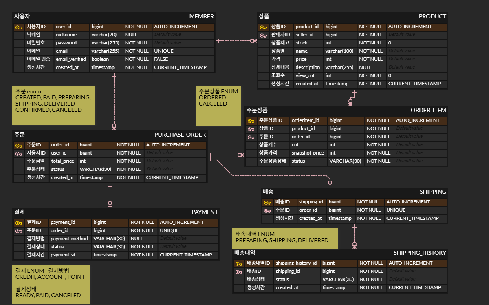

# 🛒 Order System

[//]: # (, N+1)
[//]: # ( 추후 추가하기)

> 상태 흐름을 중심으로
> 동시성, 트랜잭션, 객체지향 설계를
> 구현하며 검증한 주문/결제 시스템

## 트러블 슈팅 및 문제 해결

### 동시성 - 재고 차감 갱신 손실 해결

🔗 [재고 차감에서 갱신 손실을 해결하며 이해한 트랜잭션 락](https://jih00njung.github.io/posts/%EC%9E%AC%EA%B3%A0-%EC%B0%A8%EA%B0%90%EC%97%90%EC%84%9C-%EA%B0%B1%EC%8B%A0-%EC%86%90%EC%8B%A4%EC%9D%84-%ED%95%B4%EA%B2%B0%ED%95%98%EB%A9%B0-%EC%9D%B4%ED%95%B4%ED%95%9C-%ED%8A%B8%EB%9E%9C%EC%9E%AD%EC%85%98-%EB%9D%BD/)

- **문제**
    - 동시 주문 시 여러 트랜잭션이 동일한 재고를 수정하면서 갱신 손실이 발생하여 데이터 정합성이 깨지는 문제 확인
- **해결**
    - 비관적 락과 낙관적 락을 각각 적용하여 멀티스레드 테스트를 수행하고 처리 시간과 충돌 상황을 비교 분석
    - 프로젝트 특성에서는 성능 차이가 크지 않았으며, 구현 복잡도와 데이터 정합성을 고려하여 비관적 락을 최종 선택
- **결과**
    - 다중 스레드 환경에서도 재고 데이터의 무결성을 안정적으로 보장하도록 개선

### 트랜잭션 - 셀프 인보케이션 분석과 이벤트 기반 도메인 분리

🔗 [결제와 배송을 분리하며 이해한 트랜잭션 셀프 인보케이션](https://jih00njung.github.io/posts/%EA%B2%B0%EC%A0%9C%EC%99%80-%EB%B0%B0%EC%86%A1%EC%9D%84-%EB%B6%84%EB%A6%AC%ED%95%98%EB%A9%B0-%EC%9D%B4%ED%95%B4%ED%95%9C-%ED%8A%B8%EB%9E%9C%EC%9E%AD%EC%85%98-%EC%85%80%ED%94%84-%EC%9D%B8%EB%B3%B4%EC%BC%80%EC%9D%B4%EC%85%98/)

- **문제**
    - 결제 완료 후 배송 생성 기능을 설계하는 과정에서, 동일 클래스 내부 호출은 프록시를 거치지 않아 `@Transactional`의 전파 옵션이 적용되지 않는 셀프 인보케이션 문제를 확인
- **해결**
    - 프록시 기반 트랜잭션 동작 원리를 분석한 뒤 `ApplicationEventPublisher`를 활용하여 결제 완료 이벤트를 발행하고, 배송 도메인이 독립적으로 처리하도록 변경
- **결과**
    - 향후 트랜잭션 전파 문제를 예방하고, 결제와 배송 도메인의 책임과 결합도를 분리할 수 있는 구조를 적용

### 객체지향 설계 - DDD를 적용한 책임 분리

🔗 [엔티티는 왜 데이터만 들고 있으면 안 될까?](https://jih00njung.github.io/posts/%EC%97%94%ED%8B%B0%ED%8B%B0%EB%8A%94-%EC%99%9C-%EB%8D%B0%EC%9D%B4%ED%84%B0%EB%A7%8C-%EB%93%A4%EA%B3%A0-%EC%9E%88%EC%9C%BC%EB%A9%B4-%EC%95%88-%EB%90%A0%EA%B9%8C/)

- **문제**
    - 서비스 계층에 비즈니스 규칙이 집중되어 재사용성과 유지보수성이 떨어지고 객체지향적인 설계가 어려운 구조
- **해결**
    - 엔티티가 자신의 상태 변경 규칙을 직접 수행하도록 도메인 모델 패턴(DDD)을 적용하고 서비스는 흐름만 조율하도록 역할을 분리
- **결과**
    - 엔티티의 응집도를 높이고 서비스 계층의 복잡도를 줄여 변경에 유연한 구조를 구축

---

## 기술 스택

- **Backend**: Java 17, Spring Boot 3.5.14, Spring Data JPA
- **Database**: MySQL 8.0
- **Build Tool**: Gradle

---

## ERD

